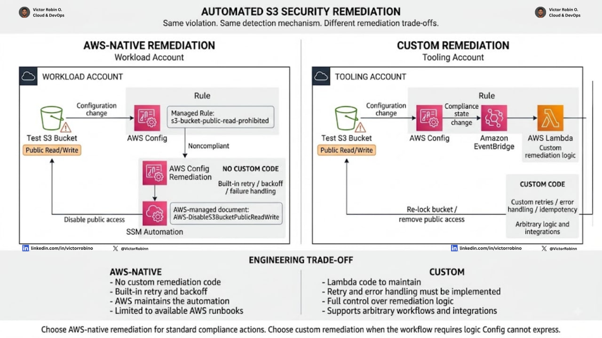

# Automated S3 Security Remediation: Two Patterns, One Trade-off

A misconfigured public S3 bucket is one of the most common, most damaging cloud misconfigurations there is. Detecting it isn't the hard part; AWS Config does that out of the box. The real decision is *how* you remediate it automatically, and what that choice costs you operationally over time.

This project builds both legitimate answers side by side, in separate accounts, so the trade-off is something you can point at instead of something you have to take on faith.

## Architecture



## The two paths

- **Workload account: AWS-native remediation.** Config detects the violation and hands it straight to an AWS-provided SSM Automation document (`AWS-DisableS3BucketPublicReadWrite`). Zero custom code. Retry count, backoff interval, and failure handling are all declarative parameters on the Config resource itself, AWS owns and maintains the remediation logic.
- **Tooling account: custom remediation.** Config emits a compliance-change event, EventBridge routes it, a Lambda function executes arbitrary logic to re-lock the bucket. Full control over what happens, but every piece of resilience (retries, error handling, idempotency, alerting) has to be written and maintained by hand.

Same violation, same detection mechanism, two different operational cost profiles.

| | AWS-native (Config + SSM) | Custom (EventBridge + Lambda) |
|---|---|---|
| Code to maintain | None | Lambda function, indefinitely |
| Retry/backoff | Built in, config-only | Must be built and tested yourself |
| Extensibility | Limited to what the SSM document does | Arbitrary — ticketing, Slack, multi-step logic |
| Right for | Standard compliance checks with an existing AWS runbook | Conditional logic, third-party integration, workflows Config can't express |

Knowing which column a given requirement falls into — and being able to justify it — is the actual skill this project is meant to demonstrate, not the ability to turn on Config.

## Engineering decisions worth knowing about

A few things surfaced during the build that say more than a clean happy-path deploy would:

- **Resource ordering bug.** An early version had `DeliveryChannel` depending on `ConfigRecorder`; backwards from what Config actually needs. The recorder tried to start before a delivery channel existed to attach to, and CloudFormation retried silently with no error until it timed out. Fixed by inverting the dependency so the channel exists first.
- **Parameter contract mismatch.** `AWS::Config::RemediationConfiguration` failed with a generic 400 because the SSM document's real parameter name is `S3BucketName`, not the more intuitive `BucketName` shown in most examples: a reminder that AWS-managed runbooks have their own parameter contracts that don't always match their plain-English names.
- **Principal-type validation.** Changing the Config delivery bucket's policy principal from `Service: config.amazonaws.com` to an explicit IAM role ARN broke Config's internal write validation. Config specifically checks for the service principal when confirming delivery permissions, a role ARN, even with equivalent permissions, isn't accepted.

## Docs

- `docs/v1/DEPLOYMENT_GUIDE.md`: deploy order and the manual trigger step
- `docs/v1/CLEANUP_GUIDE.md`: teardown

## Structure

```
automated-security-remediation/
├── README.md
├── docs/
│   └── v1/
│       ├── DEPLOYMENT_GUIDE.md
│       └── CLEANUP_GUIDE.md
└── v1/
    └── cloudformation/
        ├── test-bucket.yaml
        ├── workload/
        │   ├── 01-config-recorder.yaml
        │   ├── 02-remediation-iam.yaml
        │   └── 03-native-remediation.yaml
        └── tooling/
            ├── 01-config-recorder.yaml
            ├── 02-remediation-iam.yaml
            ├── 03-custom-remediation.yaml
            └── index.py
```

`index.py` sits alongside the Tooling stack as a readable copy of the remediation logic, the actual deployed source is the inline `ZipFile` block inside `03-custom-remediation.yaml`.